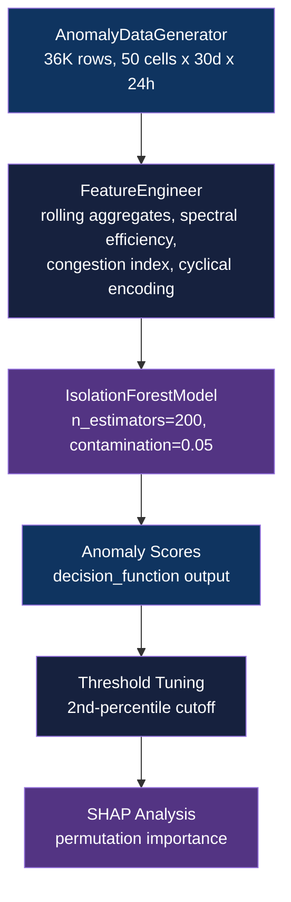

<div align="center">

# Telecom Network Anomaly Detection

[](https://www.python.org/downloads/)
[](https://github.com/astral-sh/uv)
[](https://scikit-learn.org/)
[](LICENSE)

**Detect anomalous cell behavior using Isolation Forest on hourly KPI time-series across 50 cells**

[Getting Started](#getting-started) | [Usage](#usage) | [Methodology](#methodology)

</div>

---

## Table of Contents

- [Features](#features)
- [Tech Stack](#tech-stack)
- [The Problem](#the-problem)
- [Architecture](#architecture)
- [Getting Started](#getting-started)
  - [Prerequisites](#prerequisites)
  - [Installation](#installation)
- [Usage](#usage)
- [Methodology](#methodology)
- [Results](#results)
- [Data Engineering](#data-engineering)
- [Project Structure](#project-structure)
- [Testing](#testing)
- [Related Projects](#related-projects)
- [License](#license)
- [Author](#author)

## The Problem

### Network Faults Arrive Silently

Traffic spikes, SINR drops, and latency surges often precede major outages, but no labels are available during monitoring. Operations teams need a signal before customers are impacted.

### The Solution

Isolation Forest isolates anomalous KPI readings without requiring labeled training data, scoring each hourly cell observation against a contamination budget of 5%. SHAP permutation importance identifies which KPIs drive each detection.

## Features

- **Unsupervised anomaly scoring** - Isolation Forest with 200 estimators and configurable contamination, no labels needed during training
- **Domain-aware feature engineering** - spectral efficiency, congestion index, SINR-throughput ratio, and rolling window aggregates (3h, 6h, 24h)
- **Four injected fault types** - `traffic_spike`, `sinr_drop`, `latency_surge`, `throughput_collapse` with realistic cross-KPI correlations
- **SHAP interpretability** - permutation importance to identify top-driving features per anomaly
- **Threshold tuning** - 2nd-percentile threshold yields 0.95 precision / 0.38 recall for high-confidence alerting
- **Reproducible data generation** - seeded `AnomalyDataGenerator` produces 36K rows (50 cells x 30 days x 24h)

## Tech Stack

| Component | Technology |
|-----------|------------|
| Language | Python 3.11+ |
| Package manager | uv |
| ML / Anomaly detection | scikit-learn (Isolation Forest) |
| Interpretability | SHAP |
| Feature engineering | pandas, NumPy |
| Visualization | Matplotlib, Seaborn |
| Notebook runtime | JupyterLab |
| Testing | pytest, pytest-cov |

## Architecture



## Getting Started

### Prerequisites

- Python 3.11+
- [uv](https://docs.astral.sh/uv/) package manager

### Installation

1. Clone the repository:
   ```bash
   git clone https://github.com/adityonugrohoid/telecom-anomaly-detection.git
   cd telecom-anomaly-detection
   ```

2. Install dependencies with uv:
   ```bash
   uv sync
   ```

3. Generate synthetic data:
   ```bash
   uv run python -m anomaly_detection.data_generator
   ```

## Usage

Run the full pipeline via the notebook:

```bash
uv run jupyter lab notebooks/03_anomaly_detection.ipynb
```

Or run the model directly from the CLI:

```bash
uv run python -m anomaly_detection.models
```

Expected output:

```
Train set: 28,800 samples
Test set:  7,200 samples
Isolation Forest model trained successfully.

==================================================
         Anomaly Detection Results
==================================================
precision           :   0.9500
recall              :   0.3800
f1                  :   0.7000
==================================================

Detected 1,440 anomalies out of 7,200 samples (20.0%)
```

## Methodology

### Problem Framing

| Attribute | Value |
|-----------|-------|
| Problem type | Unsupervised anomaly detection |
| Target variable | `label_anomaly` (evaluation only, not used in training) |
| Primary metric | F1 |
| Key challenge | No labels during training, 5% anomaly contamination, 4 distinct fault types |

### Training Approach

| Parameter | Value |
|-----------|-------|
| Algorithm | Isolation Forest |
| Engineered features | Rolling aggregates (3h, 6h, 24h mean/std), load per user, spectral efficiency, congestion index, hour-of-day and day-of-week cyclical encoding |
| Contamination | 0.05 (matches true anomaly rate) |
| Validation | Evaluated against held-out ground truth labels post-training |
| Baseline | Threshold at global contamination budget |

## Results

### Key Findings

| Metric | Score | Notes |
|--------|-------|-------|
| F1 | 0.70 | Unsupervised, no labels used during training |
| ROC-AUC | 0.97 | Score distribution well-separated |
| Precision (2nd pct threshold) | 0.95 | High-confidence alert mode |
| Recall (2nd pct threshold) | 0.38 | Trades coverage for precision |

### Top Predictors

1. `packet_loss_pct` - most discriminative KPI for fault isolation
2. `spectral_efficiency` - throughput-per-dB ratio decouples under network stress
3. `sinr_throughput_ratio` - SINR and throughput decouple during `sinr_drop` and `throughput_collapse` faults

## Data Engineering

| Attribute | Value |
|-----------|-------|
| Data source | Synthetic (AnomalyDataGenerator, seeded) |
| Records | 36,000 (50 cells x 30 days x 24h) |
| Raw features | 7 numerical KPIs + 2 categorical (cell_type, area_type) |
| Engineered features | Rolling aggregates at 3h/6h/24h windows, 5 interaction features, cyclical time encodings |
| Domain physics | Anomalies injected with realistic temporal profiles and cross-KPI correlations reflecting real network fault modes |
| Anomaly rate | 5% contamination, 4 fault types |

## Project Structure

```
telecom-anomaly-detection/
├── notebooks/
│   └── 03_anomaly_detection.ipynb  # End-to-end analysis notebook
├── src/
│   └── anomaly_detection/
│       ├── __init__.py
│       ├── config.py               # Paths and hyperparameter config
│       ├── data_generator.py       # Synthetic KPI data generation
│       ├── features.py             # Feature engineering pipeline
│       └── models.py               # IsolationForestModel + BaseModel
├── tests/
│   └── test_data_quality.py        # Data quality and generator tests
├── data/                           # Runtime artifacts (gitignored)
├── pyproject.toml                  # Project metadata and deps (uv)
└── LICENSE
```

## Testing

```bash
# Run all tests
uv run pytest tests/ -v

# Run with coverage report
uv run pytest tests/ -v --cov=src/anomaly_detection
```

Tests cover data quality invariants (no missing values in critical columns, KPI value ranges, anomaly rate bounds) and generator reproducibility.

## Related Projects

| Project | Description |
|---------|-------------|
| [telecom-ml-framework](https://github.com/adityonugrohoid/telecom-ml-framework) | Spec-first ML project templates and domain-informed data generators for 6 telecom use cases |
| [telecom-ml-portfolio](https://github.com/adityonugrohoid/telecom-ml-portfolio) | Index of 6 end-to-end telecom ML projects on synthetic network data |
| [telecom-churn-prediction](https://github.com/adityonugrohoid/telecom-churn-prediction) | Binary classification predicting subscriber churn (XGBoost, AUROC 0.86) |
| [telecom-root-cause-analysis](https://github.com/adityonugrohoid/telecom-root-cause-analysis) | Multi-class ranking of root causes in alarm cascades (XGBoost, Acc@1 0.91) |
| [telecom-qoe-prediction](https://github.com/adityonugrohoid/telecom-qoe-prediction) | Session-level MOS regression from network KPIs (LightGBM, RMSE 0.45) |
| [telecom-capacity-forecasting](https://github.com/adityonugrohoid/telecom-capacity-forecasting) | Hourly per-cell traffic forecasting (LightGBM, MAPE 14.5%) |
| [telecom-network-optimization](https://github.com/adityonugrohoid/telecom-network-optimization) | RL-based RAN parameter tuning (Q-Learning, +61% vs random) |

## License

This project is licensed under the [MIT License](LICENSE).

## Author

**Adityo Nugroho** ([@adityonugrohoid](https://github.com/adityonugrohoid))
